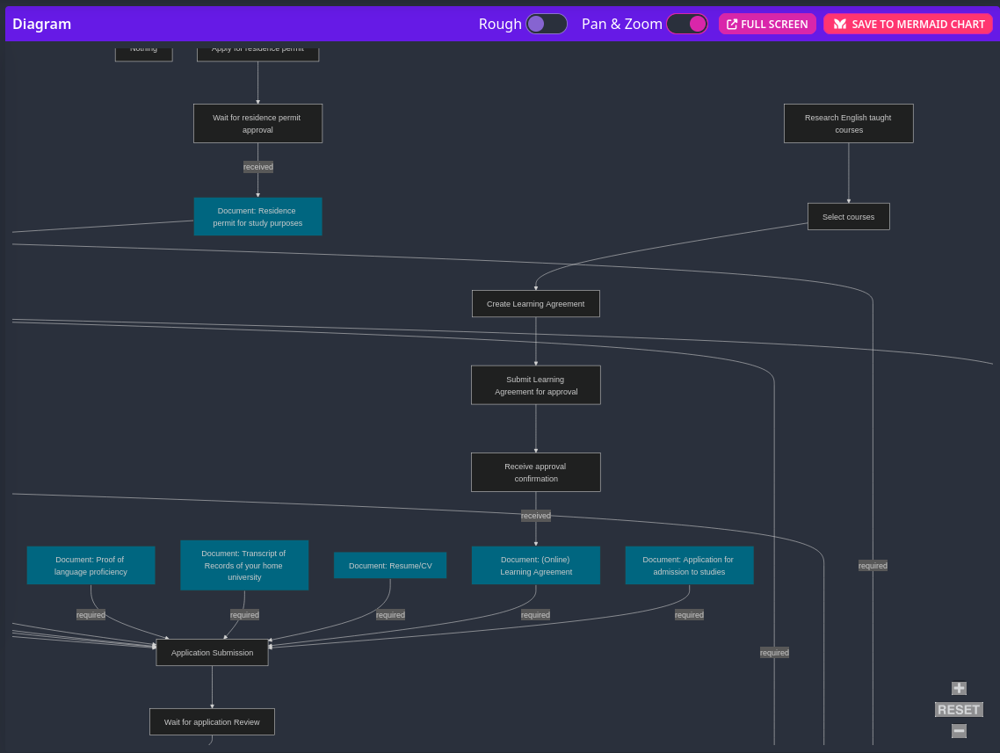

# Process extractor

The scripts in this directory are used to extract the process from a downloaded html file to a json file with the help of LLMs.
The extracted json process was also used to generate a mermaid diagram to visualize the process.

## Outcome


_Visualized with https://mermaid.live/_

```json
"phases": [
    {
      "name": "Application and admission procedures",
      "steps": [
        {
          "name": "Application Submission",
          "description": "Submit application documents to HTW Dresden",
          "required_steps": [],
          "next_steps": [
            "Wait for application Review"
          ],
          "deadline": "15 June for winter semester and 15 November for summer semester",
          "required_documents": [
            {
              "name": "Application for admission to studies",
              "description": "Signed by you and your home university coordinator"
            },
            {
              "name": "(Online) Learning Agreement",
              "description": "Your course selection approved and signed by your and your home university coordinator"
            },
            ...
          ],
          "received_documents": []
        },
        {
          "name": "Wait for application Review",
          "description": "Wait for reviewing of application documents by HTW Dresden",
          "required_steps": [
            "Application Submission"
          ],
          "next_steps": [
            "Apply for visa",
            "Register for student residence",
            "Obtain Health Insurance"
          ],
          "deadline": null,
          "required_documents": [],
          "received_documents": [
            {
              "name": "Letter of Admission",
              "description": "Official Letter of Admission"
            }
          ]
        }
      ]
    },
    {
      "name": "Learning Agreement / study schedule / Course selection",
      "steps": [
        {
          "name": "Research English taught courses",
          "description": "Browse the HTW Dresden website for English taught courses",
          "required_steps": [],
          "next_steps": [
            "Select courses"
          ],
          "deadline": null,
          "required_documents": [],
          "received_documents": []
        },
```

## Getting started

1. Set your environment variables in a `.env` file. E.g. `cp example.env .env` and fill in the values.
2. Make sure you have [poetry](https://python-poetry.org/) installed.
3. Run `poetry install` to install the dependencies.
4. Run the process-scraper.py to generate the htw_process.json file.
5. Run the processJson2MermaidDiagram.py to generate the process_diagram.mmd file.
6. View the diagram e.g. with https://mermaid.live/

### Useful files:

- process.txt
- htw_process.json
- process_diagram.mmd

### Useful scripts:

- process-scraper.py (generates htw_process.json)
- processJson2MermaidDiagram.py (generates process_diagram.json)

## Notes regarding the process-scraper.py

The current process extraction is not 100% accurate due to the reason that the steps are submitted to the AI split into
separated parts. Thus, it is impossible to extract all dependencies to other steps. To solve this issue I extracted the
whole text describing the whole process.
The extracted text is saved as `process.txt`.
Because the input tokens are quite limited for the LLM's I needed to split the whole text into smaller chunks and ask to
finetune the json (also input to the LLM). I needed to repeat the process until the whole text is processed.

Google Gemini has a larger context window and can process the whole text at once.
Prompt:
```text
htw_process.txt is describing the process for students coming to Germany.

Fix the process by adding missing dependencies, steps or descriptions.
You can find the current json representation of the process in process.txt.

Only return the changed parts of the json process.
Only return json!
```

## Tbd.:

Validate the process with the "Stabstelle Internationales der HTW Dresden" to ensure the correctness of the process.

Add more detailed information to the deadline e.g.:

```json
"deadline": {
"winter_semester": "June 15",
"summer_semester": "November 15"
}
```

Remove field next_steps from the json.
The mermaid generator currently only checks for required_steps and documents.

Make one list with all documents and the only reference in required_documents and received_documents to remove redundant
description and prevent inconsistencies.

Add more detailed instructions to the steps.

Add condition when different processes are even necessary for specific students.

Links in JSON:
- required_documents -> received_documents
- next_steps -> required_steps

Duplikat:
- Arrival -> Timetable
- During studies -> Timetable
  Sollte man zusammenfassen